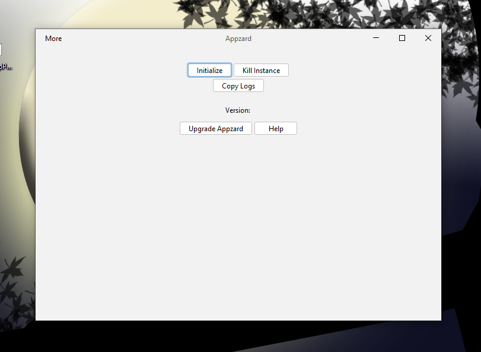

A simple GUI that lets you do some simple things that maybe difficult for some users ☺️

- Initialize - Initialize Appzard
- Kill Instance - Force stops Appzard
- Install Appzard Directly and add Path to Environment variables directly

### Installation

Click on 'More' menu and click 'Install Appzard'.
 
You can also add Path to system variables from the button.

Feel free to contribute!

Thanks! Yay!